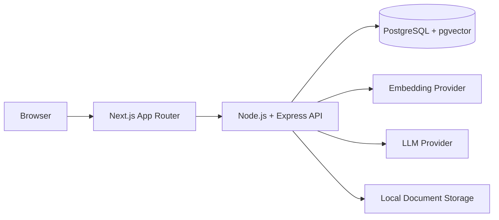

# KnowledgeFlow AI

KnowledgeFlow AI is a full-stack enterprise RAG knowledge assistant built with React/Next.js,
Node.js, TypeScript, PostgreSQL, pgvector, and OpenAI-compatible provider abstractions. It turns
uploaded company documents into grounded answers with inspectable citations and request metrics.

The project keeps the important AI boundaries visible—ingestion, extraction, chunking, embeddings,
retrieval, context control, generation, citations, and observability—without hiding them behind an
ORM, agent framework, or separate vector database.

## Overview

Teams upload PDF, TXT, or Markdown knowledge. The API validates and stores each file, extracts and
normalizes text, creates boundary-aware chunks, generates 1536-dimensional embeddings, and stores
them in PostgreSQL. Questions use the same embedding provider for exact cosine retrieval; only
sufficiently relevant chunks reach the LLM. Answers, citations, conversations, latency, token usage,
and supported cost estimates are persisted.

## Key features

- Defensive document upload, local storage abstraction, extraction, normalization, and chunking
- OpenAI and deterministic offline mock providers for both embeddings and answer generation
- Exact pgvector cosine search with configurable top-K and relevance filtering
- Deterministic insufficient-context response that skips unnecessary LLM calls
- Bounded conversation history and retrieved context with prompt-injection-aware instructions
- Grounded assistant answers with expandable source excerpts and retrieval similarity
- Persisted conversations plus real usage, cost, latency, health, and knowledge-base dashboards
- No API keys, raw embeddings, hidden prompts, storage paths, or stack traces exposed to browsers

## Architecture



Next.js route handlers proxy browser requests to the API. Express owns configuration, validation,
document processing, retrieval, conversations, and observability. PostgreSQL is both the relational
and vector store. See [Architecture](docs/ARCHITECTURE.md), [RAG](docs/RAG.md), and
[Security](docs/SECURITY.md).

## RAG pipeline

```text
Upload → Extraction → Normalization → Chunking → Embeddings → PostgreSQL + pgvector
Question → Embedding → Vector retrieval → Relevance filter → Controlled context → LLM → Citations
```

Exact search is intentional for the portfolio-scale corpus. When no chunk passes
`RAG_MIN_SIMILARITY`, the LLM is skipped and the API returns a fixed insufficient-knowledge answer.

## Tech stack

| Area           | Technology                                                                          |
| -------------- | ----------------------------------------------------------------------------------- |
| Frontend       | Next.js 16 App Router, React 19, TypeScript, Tailwind CSS, TanStack React Query     |
| Backend        | Node.js 20, Express 5, Zod, `pg`                                                    |
| Database       | PostgreSQL 16, pgvector, node-pg-migrate                                            |
| AI             | Official OpenAI Node.js SDK, embedding and LLM provider abstractions, offline mocks |
| Testing        | Node test runner, Supertest, Vitest, React Testing Library                          |
| Infrastructure | npm workspaces, Docker Compose                                                      |

## Demo

The [`demo-data`](demo-data) directory contains safe fictional ParcelFlow policies for refunds,
delivery, customer support, security, and FAQs. After uploading them, try:

- “What does the company refund policy say?”
- “When is a package considered lost?”
- “What should support do when tracking has not updated?”
- “What should an employee do after suspected account compromise?”
- “What is the capital of Japan?” — demonstrates the insufficient-knowledge behavior

### Screenshot checklist

Screenshots are intentionally not fabricated or committed from a machine-specific session. For a
portfolio capture, use seeded demo documents and capture:

1. Dashboard with live workspace and system status
2. Documents list with ready/processing states
3. Document details with expanded knowledge chunks
4. Assistant grounded answer with expanded citation and developer details
5. Assistant insufficient-knowledge response
6. Analytics with recorded request metrics

## Running locally

```powershell
npm install
Copy-Item .env.example .env
npm run db:up
npm run db:migrate
npm run dev
```

- Web: `http://localhost:3000`
- API: `http://localhost:3001`
- Health: `http://localhost:3001/health`
- Migration status: `npm run db:migrate:status`
- Stop PostgreSQL without deleting data: `npm run db:down`

## Mock mode

The committed example configuration is free, offline, deterministic, and makes no external AI
requests:

```dotenv
AI_PROVIDER=mock
LLM_PROVIDER=mock
OPENAI_API_KEY=
```

Mock embeddings use normalized-term feature hashing and a mock-only collision guard. The mock LLM
returns a predictable excerpt-based response; it is designed for development and tests, not as a
semantic equivalent to a production model.

## OpenAI mode

Put these values only in your ignored local `.env` or deployment secret store:

```dotenv
AI_PROVIDER=openai
LLM_PROVIDER=openai
OPENAI_API_KEY=your-local-secret-key
EMBEDDING_MODEL=text-embedding-3-small
LLM_MODEL=gpt-4.1-mini
```

Restart the API, upload the fictional demo documents, wait for `Ready`, and ask the demo questions.
The API uses a 30-second timeout and two transient-error retries. The key remains server-side and
must never use a `NEXT_PUBLIC_` prefix.

> **Important:** mock embeddings and OpenAI embeddings are different vector spaces. Delete and
> re-upload (or otherwise reprocess) every document after switching `AI_PROVIDER` or embedding
> models. Never query OpenAI embeddings against mock-generated stored vectors, or vice versa.

For a minimal real-provider smoke test, upload only `demo-data/refund-policy.md`, ask “What does the
company refund policy say?”, inspect its citation and usage details, then ask “What is the capital
of Japan?” to verify rejection before generation. Automated tests never call OpenAI.

## Environment variables

`.env.example` documents every setting. The principal groups are:

- Runtime: `API_PORT`, `DATABASE_URL`, `NEXT_PUBLIC_API_URL`
- Ingestion: `MAX_UPLOAD_SIZE_MB`, `STORAGE_DIRECTORY`, `CHUNK_SIZE`, `CHUNK_OVERLAP`
- Providers: `AI_PROVIDER`, `LLM_PROVIDER`, `OPENAI_API_KEY`, model names, timeout and batch limits
- Retrieval: `RAG_TOP_K`, `RAG_MIN_SIMILARITY`, context and history budgets

The pgvector schema is fixed at `EMBEDDING_DIMENSION=1536`, matching the configured output for
`text-embedding-3-small`.

## Testing

PostgreSQL must be running for API integration tests:

```powershell
npm run db:up
npm run check
npm run build
```

`check` runs lint, formatting verification, workspace typechecks, API unit/integration tests, and
frontend component tests. The current suite contains 27 passing API tests and 22 passing frontend
tests; automated tests use mock clients and never call OpenAI.

## AI safety

- Weak or missing retrieval produces a deterministic refusal before LLM generation.
- Retrieved documents are labeled as untrusted data, not instructions.
- Conversation history and knowledge context are bounded.
- API keys stay server-side; embeddings and hidden instructions are never returned.
- Logs retain safe identifiers and metrics rather than document bodies or credentials.

These controls reduce hallucination and prompt-injection risk; they do not eliminate it.

## Token and cost management

Real token counts come from provider response usage. Mock requests store null token counts rather
than invented values. Model pricing is centralized; unknown models return no estimate. Pricing can
change, so the local table must be reviewed before estimates are used operationally.

## Known limitations

- No authentication, tenant isolation, document-level authorization, or rate limiting
- No OCR for scanned PDFs
- Synchronous ingestion and answer generation
- Character-based rather than tokenizer-exact context budgeting
- Exact vector search is intended for a small corpus
- Local filesystem storage is single-host only
- Prompt-injection controls and retrieval thresholds require ongoing evaluation

## Future improvements

- Authentication, authorization, and tenant-isolated retrieval
- S3 or Azure Blob storage with malware scanning and retention controls
- Durable background ingestion workers
- OCR and richer document parsers
- Tokenizer-aware budgeting and a formal retrieval evaluation suite
- HNSW after measured corpus and latency growth
