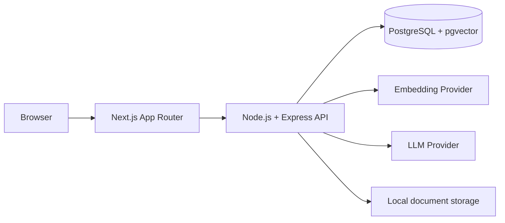

# KnowledgeFlow AI

KnowledgeFlow AI is a transparent, production-minded internal knowledge assistant. Teams upload
company documents, the API extracts and indexes their content in PostgreSQL with pgvector, and the
assistant answers questions from retrieved evidence with inspectable citations and usage metrics.

The project deliberately exposes the important RAG boundaries—storage, extraction, chunking,
embeddings, retrieval, context construction, generation, citations, and observability—without a
heavy ORM, agent framework, queue, or separate vector database.

## Features

- PDF, TXT, and Markdown upload with local storage and defensive validation
- Text extraction, normalization, boundary-aware chunking, and idempotent reprocessing
- OpenAI and deterministic offline mock embedding providers
- Exact cosine similarity search in PostgreSQL using pgvector
- Configurable top-K retrieval, relevance threshold, history limit, and context budget
- Grounded answers with deterministic insufficient-context behavior
- OpenAI Responses API and deterministic mock LLM providers
- Persisted conversations, messages, citations, latency, token usage, and optional cost estimates
- Assistant, document inspection, conversation history, health, and analytics UI
- No embedding vectors, hidden prompts, storage paths, or API keys exposed to the browser

## Screenshots

Screenshots are intentionally not committed from a machine-specific local session. For a portfolio
capture, start the application, upload `demo-data/*.md`, then capture:

1. `/documents` showing ready documents
2. `/assistant` showing a grounded answer, expanded source, and RAG details
3. `/analytics` showing the resulting request metrics

## Architecture



The frontend proxies browser requests through Next.js route handlers. The Express API owns
configuration, validation, processing, retrieval, conversations, and observability. PostgreSQL is
the relational and vector store; uploaded bytes remain behind a replaceable storage abstraction.
See [Architecture](docs/ARCHITECTURE.md), [RAG](docs/RAG.md), and [Security](docs/SECURITY.md).

## RAG pipeline

```text
Upload → Extract → Normalize → Chunk → Embed → PostgreSQL
Question → Embed → Cosine search → Relevance filter → Bounded context → LLM → Answer + sources
```

Exact search is intentional for the initial small corpus. HNSW is deferred until corpus size and
latency measurements justify approximate indexing. When no chunk passes `RAG_MIN_SIMILARITY`, the
LLM is skipped and the API returns a fixed insufficient-knowledge response.

## Tech stack

- Node.js 20.16+, TypeScript, npm workspaces
- Express 5, Zod, `pg`, `node-pg-migrate`
- PostgreSQL 16, pgvector
- Next.js 16 App Router, React 19, Tailwind CSS, TanStack React Query
- Official OpenAI Node.js SDK with provider abstractions
- Node test runner, Supertest, Vitest, React Testing Library
- Docker Compose for local PostgreSQL

## Local development

```powershell
npm install
Copy-Item .env.example .env
docker compose up -d postgres
npm run db:migrate
npm run dev
```

The API runs at `http://localhost:3001`, the web app at `http://localhost:3000`, and API health is
available at `GET http://localhost:3001/health`. `npm run dev` starts API and web together; the
individual commands are `npm run dev:api` and `npm run dev:web`.

Upload the fictional ParcelFlow demo documents from `demo-data`, then try:

- “How long does a damaged parcel refund take?”
- “Can a customer change the delivery address after dispatch?”
- “What information must support never request?”
- “What should an employee do after suspected account compromise?”
- “What soup is served in the office today?” — demonstrates insufficient knowledge

## Environment variables

| Variable                       |                  Default | Purpose                                                    |
| ------------------------------ | -----------------------: | ---------------------------------------------------------- |
| `DATABASE_URL`                 |        local Compose URL | PostgreSQL connection string                               |
| `NEXT_PUBLIC_API_URL`          |  `http://localhost:3001` | Public API origin used by Next.js proxies                  |
| `MAX_UPLOAD_SIZE_MB`           |                     `10` | Upload size limit                                          |
| `STORAGE_DIRECTORY`            |      `storage/documents` | Private local document bytes                               |
| `CHUNK_SIZE` / `CHUNK_OVERLAP` |           `1200` / `200` | Character-based chunking                                   |
| `AI_PROVIDER`                  |                   `mock` | Embedding provider: `mock` or `openai`                     |
| `EMBEDDING_MODEL`              | `text-embedding-3-small` | OpenAI embedding model                                     |
| `EMBEDDING_DIMENSION`          |                   `1536` | Fixed pgvector schema contract                             |
| `EMBEDDING_BATCH_SIZE`         |                     `32` | Ordered embedding batch size                               |
| `LLM_PROVIDER`                 |                   `mock` | Answer provider: `mock` or `openai`                        |
| `LLM_MODEL`                    |           `gpt-4.1-mini` | OpenAI response model                                      |
| `OPENAI_API_KEY`               |                    empty | Server-only credential required for either OpenAI provider |
| `OPENAI_TIMEOUT_MS`            |                  `30000` | External provider timeout                                  |
| `RAG_TOP_K`                    |                      `5` | Candidate chunks returned by retrieval                     |
| `RAG_MIN_SIMILARITY`           |                   `0.15` | Minimum cosine similarity; tune through evaluation         |
| `RAG_MAX_CONTEXT_CHARACTERS`   |                  `12000` | Retrieved context/history budget                           |
| `RAG_MAX_HISTORY_MESSAGES`     |                     `10` | Recent persisted messages included                         |

### Mock mode

The committed defaults require no AI key and make no external requests. Mock embeddings use
deterministic normalized-term feature hashing plus a mock-only collision guard, while the mock LLM
returns a predictable excerpt-based answer. Mock mode is useful for development and tests but is
not semantically equivalent to a real model. Reprocess documents after changing embedding models
or provider implementations; stored and query vectors must use the same representation.

### OpenAI mode

Set `AI_PROVIDER=openai`, `LLM_PROVIDER=openai`, and a valid server-side `OPENAI_API_KEY`. Either
provider can independently remain `mock`. Never expose the key with a `NEXT_PUBLIC_` prefix.

## Database workflow

```powershell
npm run db:up
npm run db:migrate
npm run db:migrate:status
npm run db:down
```

`db:down` preserves the named database volume. `docker compose down -v` deletes it.

## Testing

```powershell
npm run check
npm run build
```

`check` runs linting, formatting verification, workspace typechecks, API unit/integration tests,
and frontend component tests. PostgreSQL integration tests require the Compose database.
Automated tests never call OpenAI.

## AI safety

Retrieved text is explicitly labeled as untrusted data, not instructions. Context is bounded,
weak retrieval is filtered before generation, and absent evidence produces a deterministic refusal.
These controls reduce prompt-injection and hallucination risk but do not eliminate it. See
[Security](docs/SECURITY.md).

## Token and cost management

Real-provider token counts come directly from OpenAI response usage. Mock mode stores null token
counts rather than inventing them. Cost estimation is centralized and returns null for unknown or
mock models. Pricing changes over time and the local pricing table must be reviewed before relying
on estimates.

## Known limitations

- No authentication, tenant isolation, document-level authorization, or rate limiting
- No OCR for scanned PDFs
- Synchronous ingestion and response generation
- Character-based rather than tokenizer-exact context budgeting
- Exact vector search is intended for a small corpus
- Local filesystem storage is single-host only
- Prompt-injection defenses and retrieval thresholds require ongoing evaluation

## Future improvements

- Authentication, authorization, and tenant-aware retrieval filters
- Background processing and durable job execution
- OCR and richer document parsers
- Evaluation datasets, relevance feedback, and threshold tuning
- HNSW after measured corpus/latency growth
- Streaming answers, reranking, and hybrid lexical/vector retrieval
- Object storage, malware scanning, retention controls, and deployment automation
