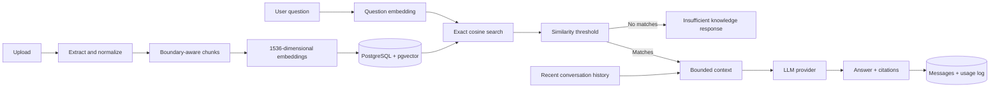

# Retrieval-Augmented Generation

KnowledgeFlow AI grounds answers in uploaded company documents. It does not currently use web
search, tools, or autonomous agents.

## Pipeline

1. PDF, TXT, and Markdown uploads are stored locally and their metadata is stored in PostgreSQL.
2. Text is extracted without executing document content, then conservatively normalized.
3. Chunks target natural heading, paragraph, and sentence boundaries with controlled overlap.
4. The configured provider creates 1536-dimensional embeddings for every chunk.
5. Questions use the same embedding provider. PostgreSQL performs exact cosine search with `<=>`.
6. `RAG_MIN_SIMILARITY` removes weak results before generation. The default `0.15` is a starting
   point, not a universal quality guarantee; tune it using representative evaluation questions.
7. Context construction keeps recent messages and highest-scoring chunks within a character
   budget. This is not exact tokenizer budgeting.
8. The LLM receives fixed grounding and prompt-injection instructions plus bounded data context.
9. Returned citations map application-controlled source IDs to the exact chunks used.
10. Messages and safe request metrics are persisted transactionally after generation.

If no chunk passes the threshold, the LLM is not called and KnowledgeFlow returns a deterministic
insufficient-knowledge response. Mock providers are deterministic testing tools; they do not have
the semantic or generative quality of production models.

## Indexing decision

KnowledgeFlow currently uses exact search. HNSW is intentionally deferred because the expected
portfolio corpus is small: exact search has perfect recall, no ANN tuning, and minimal operational
overhead. A measured latency/corpus threshold should justify an HNSW migration later.

## Limitations

- No OCR for image-only PDFs.
- Character budgets approximate, rather than measure, tokens.
- Citation correctness still requires evaluation; an LLM can format citations imperfectly.
- Similarity thresholds and chunk settings require corpus-specific evaluation.
- Processing and answer generation are synchronous in the API process.
